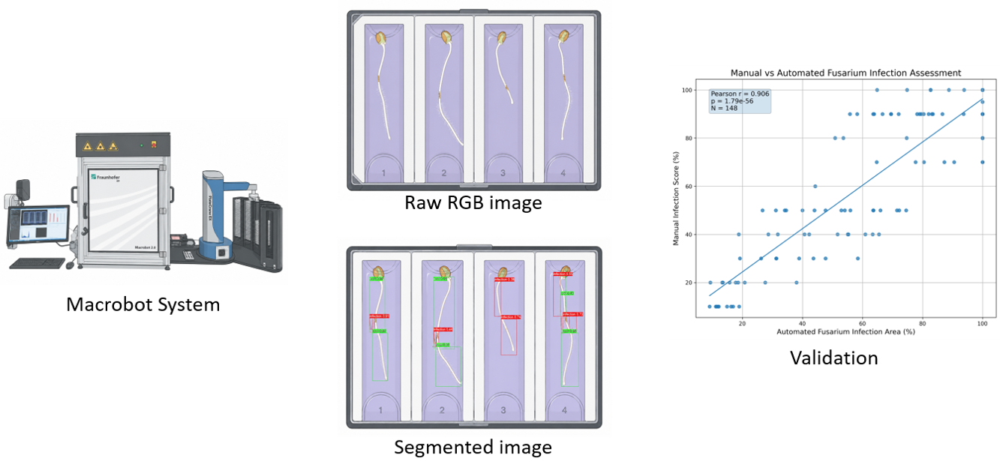

# 🌾 BluVision Root — Fusarium Root Severity Pipeline


BluVision Root is a Python pipeline for automated **Fusarium root infection analysis** from macrobot images. It preprocesses images, runs a YOLOv8 segmentation model, extracts object-level severity features, summarizes infection by four horizontal lanes, and creates convenient HTML reports for visual inspection.


---

## ✨ What this tool does

- 🖼️ Loads images from experiment folders
- ⚖️ Converts images to 8-bit and applies percentile white balance
- ✂️ Crops fixed image borders before prediction
- 🤖 Runs YOLOv8 segmentation on the preprocessed image
- 🔴 Calculates **MaxRGB dominant-channel intensity** inside each segmentation mask
- 🧫 Separates object metrics for class 0 and class 1
- 📊 Assigns each object to one of **4 lanes** based on horizontal position
- 📈 Calculates infection percentages per class and lane
- 🧾 Writes object-level and lane-level CSV summaries
- 🌐 Builds one combined HTML report per DAI/timepoint with all plates inside


---

## 📁 Expected input structure

The current default setup is for a root folder that already points to one experiment, for example `MB0504`:

```text
ROOT_FOLDER/
├── 1dai/
│   ├── 20260224_111232__T02/
│   │   └── 20260224_111232__T02_preview.tif
│   └── another_plate/
│       └── another_plate_preview.tif
├── 2dai/
│   └── plate_folder/
│       └── plate_preview.tif
```

For this layout, keep this in `config.py`:

```python
INPUT_HAS_EXPERIMENT_LEVEL = False
EXPERIMENT_NAME = "MB0504"
```

If your input root contains several experiments:

```text
ROOT_FOLDER/
├── MB0504/
│   ├── 1dai/
│   │   └── plate_folder/
│   │       └── image_preview.tif
├── MB0505/
│   └── 1dai/
│       └── plate_folder/
│           └── image_preview.tif
```

then set:

```python
INPUT_HAS_EXPERIMENT_LEVEL = True
```

---

## 📦 Installation

### 1. Create a new environment

```bash
conda create -n fusvision python=3.10 -y
conda activate fusvision
```

### 2. Install dependencies

```bash
pip install ultralytics opencv-python numpy torch torchvision
```

For GPU support, install the PyTorch build matching your CUDA version from the official PyTorch instructions.


---

## ⚙️ Configuration

Edit `config.py` before running:

```python
MODEL_PATH = r"yolov8s-seg_img1024_ep150_AdamW_lr0.0005_best.pt"
ROOT_FOLDER = r"MB0504"
OUTPUT_ROOT = r"MB0504_yolov8s"

EXPERIMENT_NAME = "MB0504"
INPUT_HAS_EXPERIMENT_LEVEL = False

IMG_SIZE = 1024
DEVICE = "cpu"   # or "0" for GPU
FILE_SUFFIX = "preview.tif"
N_LANES = 4
```

Optional filtering:

```python
ONLY_COMBINATIONS = [("MB0504", "1dai")]
```

Leave it empty to process all DAI/timepoint folders.

---

## ▶️ Usage

Run the pipeline from the folder containing `main.py`:

```bash
python main.py
```

The pipeline will:

1. find all preview images,
2. preprocess each image,
3. save the white-balanced image,
4. save MaxRGB, bounding-box, and polygon images,
5. calculate object metrics,
6. calculate lane summaries,
7. create HTML reports.

---

## 📤 Output structure

For the `MB0504 / 1dai / plate / image` layout, outputs are written like this:

```text
OUTPUT_ROOT/
├── MB0504_summary.csv
├── MB0504_lane_summary.csv
├── MB0504_report_index.html
├── 1dai/
│   ├── MB0504_1dai_all_plates_report.html
│   ├── plate_folder/
│   │   ├── image_preview_wb.png
│   │   ├── image_preview_boxes.png
│   │   ├── image_preview_poly.png
│   │   └── image_preview_maxrgb.png
```

### 🌐 HTML reports

Each DAI/timepoint has **one combined report page** containing all plates for that DAI. For every plate you see:

- white-balanced image
- bounding-box image
- polygon image
- lane infection summary
- per-object measurements

An additional `MB0504_report_index.html` links to all DAI reports.

---

## 📊 Important CSV columns

### Object-level CSV

| Column | Meaning |
|---|---|
| `class_id` | YOLO class ID |
| `class_name` | YOLO class label |
| `lane_id` | Assigned lane from 1 to 4 |
| `polygon_area_px` | Number of pixels in the object mask |
| `fusarium_severity_maxrgb_intensity` | Mean MaxRGB dominant-channel intensity for Fusarium class |
| `control_severity_maxrgb_intensity` | Mean MaxRGB dominant-channel intensity for non-Fusarium class |

### Lane-summary CSV

| Column | Meaning |
|---|---|
| `lane_polygon_count_total` | Number of objects in the lane |
| `class0_polygon_percent` | Percent of objects belonging to class 0 |
| `class0_area_percent` | Percent of segmented area belonging to class 0 |
| `class1_polygon_percent` | Percent of objects belonging to class 1 |
| `class1_area_percent` | Percent of segmented area belonging to class 1 |

---

## 🔬 MaxRGB severity calculation

The pipeline now follows the comparison script logic:

```python
maximumRGB_intensity = maximum_R + maximum_G + maximum_B
mean_intensity = np.mean(maximumRGB_intensity[mask])
```

Because the MaxRGB image keeps only the dominant channel per pixel, this measures the dominant-channel intensity inside the segmentation mask, independent of whether the dominant channel is red, green, or blue.

---

## 🧪 Notes

- The current pipeline assumes two classes: class 0 and class 1.
- `FUSARIUM_CLASS_ID = 0` controls which class is written to the Fusarium severity column.
- Lane assignment is based on the horizontal center of each bounding box.
- The HTML report uses relative paths, so the output folder can be copied as a self-contained report directory.

---

## 📜 License


## 🆕 Latest metric update

The report now uses readable biological class names instead of raw `class0` / `class1` labels:

| Model class | Report label | Meaning |
|---|---|---|
| `0` | **Fusarium infection** | infected / diseased segmentation class |
| `1` | **Root tissue** | root / non-infection segmentation class |

Two MaxRGB severity values are written for each object and lane summary:

- **MaxRGB intensity**: `maximum_B + maximum_G + maximum_R`, matching the comparison script.
- **MaxRGB red**: red channel only after MaxRGB filtering, useful when you want the stricter red-dominant signal.

You can rename the classes in `config.py` by editing:

```python
CLASS_DISPLAY_NAMES = {
    0: "Fusarium infection",
    1: "Root tissue",
}
```

---

## 🏋️ Standalone YOLO training module

The package now also contains a **separate training-only module** in:

```text
training/
├── training_config.py
├── training_overview.py
└── train_yolo.py
```

This module is intentionally independent from the prediction/reporting pipeline.
It only trains YOLO segmentation models and creates a compact CSV overview of the best runs.
It does **not** preprocess real experiment images and it does **not** run prediction.

### ⚙️ Training configuration

Edit `training/training_config.py`:

```python
DATA_YAML = Path(r"data.yaml")
TRAINING_OUTPUT_ROOT = Path(r"fus_root_training")
DEVICE = "auto"

MODELS = [
    "yolo11m-seg.pt",
    "yolo11s-seg.pt",
    "yolo26m-seg.pt",
    "yolo26s-seg.pt",
]

IMG_SIZES = [1024, 1280]
EPOCHS_LIST = [150, 300]
OPTIMIZERS = ["AdamW"]
LR0_VALUES = [0.001]
WEIGHT_DECAY_VALUES = [0.0005]
```

### ▶️ Start training

From the project folder:

```bash
cd training
python train_yolo.py \
  --source_path data.yaml \
  --destination_path fus_root_training \
  --device auto
```

Or use only the paths from `training_config.py`:

```bash
cd training
python train_yolo.py
```

### 📊 Create only the training overview

If training runs already exist and you only want to summarize them:

```bash
cd training
python train_yolo.py \
  --destination_path D:/stefanie/fus_root_high \
  --overview_only
```

This writes:

```text
model_training_overview.csv
```

The overview includes best mask mAP, mAP50, precision, recall, box metrics, and segmentation losses for every training run.
